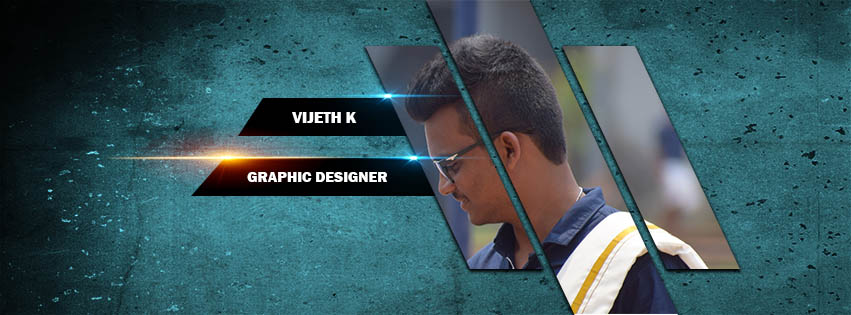

<h1 align="center">Hi , I'm Vijeth Kalavarkar</h1>
<h3 align="center">I'm a MERN Stack Developer from India.</h3>
 

## 🙋‍♂️ About Me

- 🔭 I’m currently working on **[TearsFree Website]()**

- 🌱 I’m currently learning **AWS and Devops**

- 👯 I’m looking for Job Opertunities on **IT Sector**

- 👨‍💻 Check out my Profile at **[My Portfolio](https://vijikalavarkar.github.io/Portfolio.io/)**

- 📫 How to reach me **vkalavarkar321@gmail.com**

- ⚡ Fun fact **I play video games too much LOL**

 

## 🚀 Languages and Tools:

 
    <!-- React Js-->
    
    <!-- Javascript -->
     
    <!--HTML-->
     
    <!--CSS-->
     
    <!--BootStrap-->
     
    <!-- Node Js -->
     
    <!--MySQL-->
    
    <!--Mongo DB-->
     
    <!-- Postman -->
     
    <!--Git-->  
     
    <!-- Express -->
    
    <!-- Power BI -->
    

<!--       -->
 

## Connect with me:

